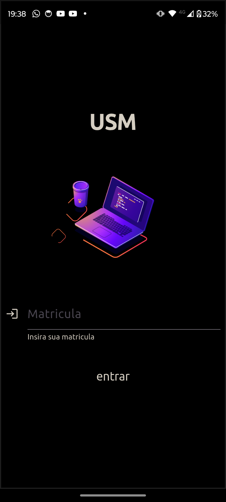
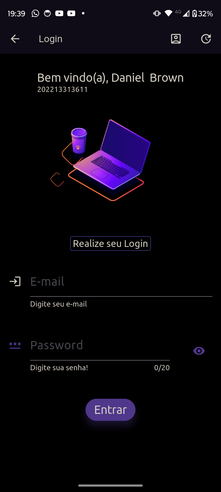
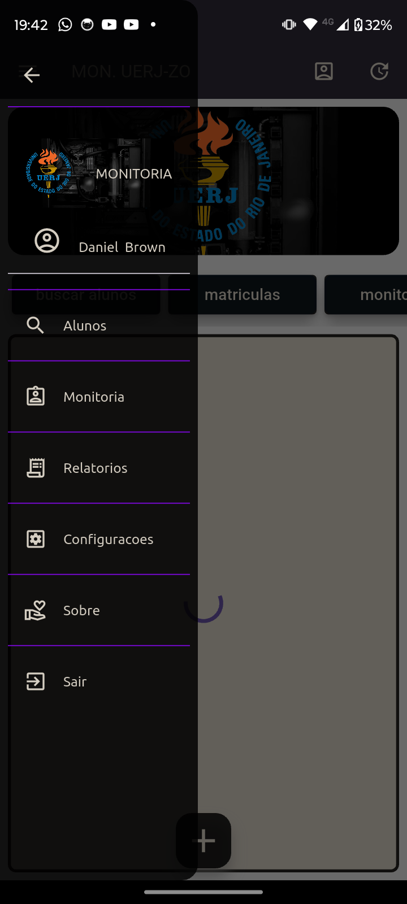
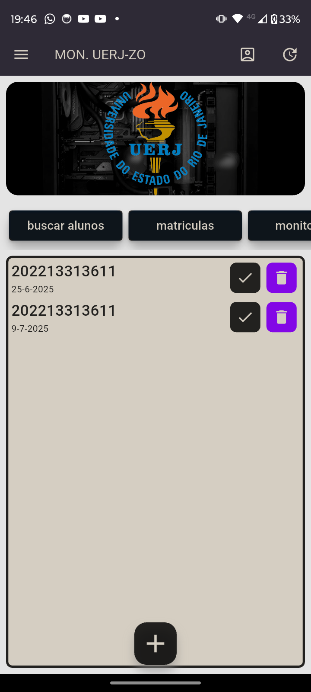
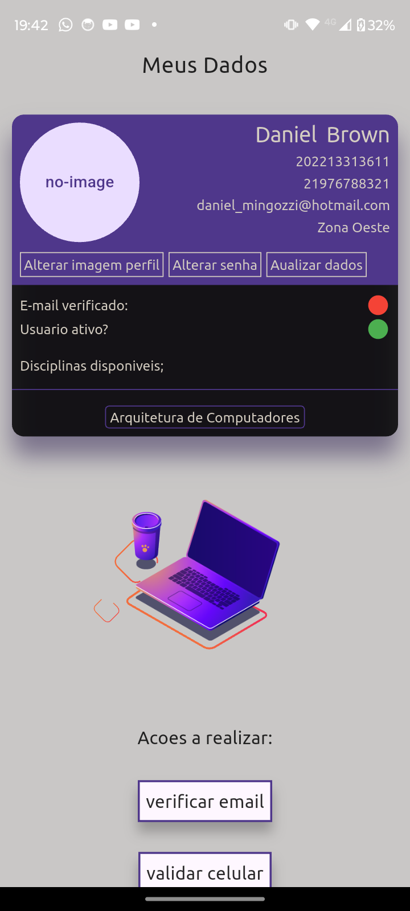

[](https://codemagic.io/app/685edcfa3096b3b0a849063b/685ef8926725832714ff2373/latest_build)

# Monitoria UERJ-ZO (USM\_Flutter)

## 🎯 Sobre o Projeto

**MON. UERJ-ZO** é um aplicativo desenvolvido em Flutter para facilitar o gerenciamento e agendamento de monitorias na UERJ-ZO. A plataforma permite que alunos e monitores interajam de forma simples e organizada, centralizando a marcação e o acompanhamento das aulas de reforço. O backend é totalmente suportado pelo Firebase, garantindo agilidade e escalabilidade.

## ✨ Funcionalidades

  * **Autenticação de Usuários:** Sistema de login seguro para alunos e monitores.
  * **Visualização de Monitorias:** Lista de monitorias disponíveis com informações detalhadas.
  * **Agendamento Simplificado:** Marque novas monitorias em poucos passos.
  * **Gestão de Agendamentos:** Acompanhe o status das suas monitorias (agendada, presente, ausente).
  * **Busca de Alunos:** Ferramenta para localizar alunos cadastrados no sistema.
  * **Painel de Configurações:** Interface para ajustes e personalizações.

## 📱 Telas Principais

  * **Login:** Tela inicial para autenticação de usuários.
  * **Home:** Painel principal com acesso rápido às principais funcionalidades e visualização das próximas monitorias.
  * **Adicionar Monitoria:** Modal para agendamento de novas monitorias, com seleção de aluno e data.
  * **Lista de Monitorias:** Tela para visualizar todos os agendamentos, com filtros por status, data, etc.
  * **Busca de Alunos:** Ferramenta de pesquisa para encontrar alunos no sistema.

## 🚀 Tecnologias Utilizadas

  * **Flutter:** Framework para desenvolvimento de interfaces de usuário nativas e multiplataforma.
  * **Dart:** Linguagem de programação moderna e otimizada para clientes.
  * **Firebase Firestore:** Banco de dados NoSQL em nuvem para armazenamento e sincronização de dados em tempo real.
  * **Provider:** Solução para gerenciamento de estado.
  * **Testes de Integração:** Para garantir a qualidade e o fluxo correto das telas.

## 🏁 Começando

Siga as instruções abaixo para obter uma cópia do projeto em sua máquina local para desenvolvimento e testes.

### Pré-requisitos

  * [Flutter SDK](https://flutter.dev/docs/get-started/install)
  * Um editor de código como [VS Code](https://code.visualstudio.com/) ou [Android Studio](https://developer.android.com/studio).
  * Uma conta no [Firebase](https://firebase.google.com/) com um projeto configurado.

### Instalação

1.  Clone o repositório:
    ```sh
    git clone https://github.com/DanielBrown1998/USM_Flutter.git
    ```
2.  Navegue até o diretório do projeto:
    ```sh
    cd ./app
    ```
3.  Instale as dependências:
    ```sh
    flutter pub get
    ```
4.  Configure o Firebase:
      * Siga as instruções do Firebase para adicionar o Flutter ao seu projeto ([Android](https://firebase.google.com/docs/flutter/setup?platform=android) e [iOS](https://firebase.google.com/docs/flutter/setup?platform=ios)).
      * Certifique-se de que o arquivo `google-services.json` (para Android) e `GoogleService-Info.plist` (para iOS) estejam nos locais corretos dentro do seu projeto Flutter.
      * Configure as regras de segurança do Firestore conforme necessário para sua aplicação.

### Executando a Aplicação

Para executar a aplicação em um emulador ou dispositivo conectado:

```bash
flutter run
```

### Executando Testes de Integração

```bash
flutter test integration_test/app_test.dart
```
## Imagens do app

<table>
  <tr>
    <td align="center">
      
    </td>
    <td align="center">
      
    </td>
    <td align="center">
      
    </td>
  </tr>
  <tr>
    <td align="center">
      
    </td>
    <td align="center">
      
    </td>
     <!-- Adicione mais <td> aqui se tiver mais imagens para esta linha -->
  </tr>
</table>


